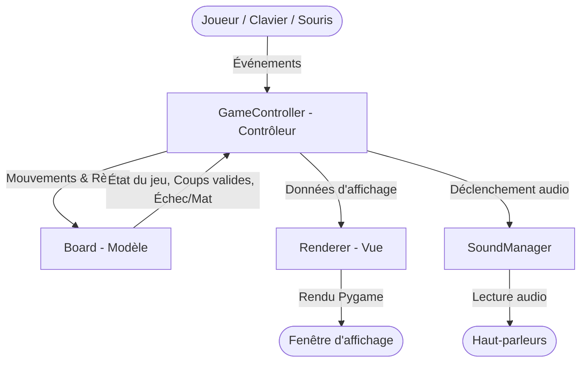

# ♟️ Jeu d'Échecs en Python (Pygame)

[](https://www.python.org/)
[](https://www.pygame.org/)
[](#-architecture-technique-mvc)
[](#-tests-unitaires--validation)
[](LICENSE)

Une application complète et moderne de **jeu d'échecs pour deux joueurs en local**, développée en **Python** avec la bibliothèque graphique **Pygame**. Le projet met en œuvre une architecture modulaire **MVC** (*Modèle-Vue-Contrôleur*), respecte rigoureusement l'ensemble des règles officielles de la **FIDE** (Fédération Internationale des Échecs), intègre une horloge de jeu configurable avec incrément, une interface réactive avec rotation d'échiquier et une ambiance sonore réaliste.

---

## 📋 Sommaire

- [✨ Fonctionnalités](#-fonctionnalités)
  - [Règles Officielles et Déplacements FIDE](#règles-officielles-et-déplacements-fide)
  - [Coups Spéciaux & Conditions de Fin de Partie](#coups-spéciaux--conditions-de-fin-de-partie)
  - [Gestion des Cadences & Pendule d'Échecs](#gestion-des-cadences--pendule-déchecs)
  - [Interface Graphique & Expérience Utilisateur](#interface-graphique--expérience-utilisateur)
  - [Ambiance Sonore Réaliste](#ambiance-sonore-réaliste)
- [🏛️ Architecture Technique (MVC)](#️-architecture-technique-mvc)
- [📂 Structure du Projet](#-structure-du-projet)
- [🚀 Installation & Démarrage](#-installation--démarrage)
  - [Prérequis](#prérequis)
  - [Installation des dépendances](#installation-des-dépendances)
  - [Téléchargement des sons (optionnel)](#téléchargement-des-sons-optionnel)
  - [Lancement du jeu](#lancement-du-jeu)
- [🎮 Comment Jouer](#-comment-jouer)
- [🧪 Tests Unitaires & Validation](#-tests-unitaires--validation)
- [🗺️ Feuille de Route (Roadmap)](#️-feuille-de-route-roadmap)
- [💖 Soutenir le Projet](#-soutenir-le-projet)

---

## ✨ Fonctionnalités

### Règles Officielles et Déplacements FIDE
- **Gestion intégrale des pièces** :
  - **Pion** : avancée d'une case, double poussée initiale, capture diagonale.
  - **Cavalier** : déplacement en « L » et capacité de saut par-dessus les obstacles.
  - **Fou** : déplacements diagonaux avec blocage par les pièces alliées et adverses.
  - **Tour** : déplacements orthogonaux (lignes et colonnes).
  - **Dame** : combinaison complète des déplacements de la Tour et du Fou.
  - **Roi** : déplacement d'une case dans toutes les directions.
- **Interdiction formelle des coups illégaux** : simulation préalable pour empêcher tout coup laissant son propre Roi en échec (y compris les pièces clouées).

### Coups Spéciaux & Conditions de Fin de Partie
- **Petit et Grand Roque** :
  - Vérification de l'immobilité préalable du Roi et de la Tour concernée.
  - Absence de pièces intermédiaires sur le chemin.
  - Interdiction stricte de roquer si le Roi est en échec, s'il traverse une case attaquée ou s'il atterrit sur une case contrôlée.
- **Prise en Passant** :
  - Activation immédiate après la double poussée d'un pion adverse adjacent.
  - Effacement automatique de la cible dès le demi-coup suivant.
- **Promotion Interactive du Pion** :
  - Fenêtre modale semi-transparente affichée dès qu'un pion atteint la dernière rangée.
  - Choix ergonomique entre **Dame**, **Tour**, **Fou** ou **Cavalier**.
  - Possibilité d'annuler le coup via une croix rouge dédiée avant confirmation.
- **Détections de fin de partie automatiques et manuelles** :
  - **Échec et Mat** : détection de l'absence de coup légal de parade lorsque le Roi est attaqué.
  - **Pat (*Stalemate*)** : joueur au trait n'ayant aucun coup légal alors que son Roi n'est pas en échec.
  - **Règle des 50 coups** : nulle automatique après 100 demi-coups sans prise de pièce ni mouvement de pion.
  - **Triple répétition de la position** : nulle détectée via une signature unique d'état (positions sur le plateau, joueur au trait, droits de roque résiduels et cible de prise en passant).
  - **Manque de matériel** : nulle automatique (Roi contre Roi, Roi + Fou contre Roi, Roi + Cavalier contre Roi).
  - **Abandon** : bouton permettant à chaque joueur de déclarer forfait à tout moment.
  - **Accord Mutuel** : proposition, acceptation ou refus interactif de partie nulle entre les joueurs.

### Gestion des Cadences & Pendule d'Échecs
- Horloge d'échecs en temps réel intégrée avec plusieurs formats de partie configurables au menu :
  - **Rapide** : 10 minutes + 15 secondes d'incrément par coup.
  - **Blitz** : 3 minutes + 2 secondes d'incrément par coup.
  - **Bullet** : 1 minute + 0 seconde.
  - **Sans temps** : mode libre sans contrainte de chronomètre.
- Décompte précis en millisecondes uniquement pour le joueur ayant le trait.
- Ajout automatique de l'incrément à la fin de chaque tour.
- Indicateur visuel d'urgence : chronomètre affiché en rouge dès que le temps passe sous la barre des 10 secondes.
- Défaite automatique au temps écoulé (`00:00`).

### Interface Graphique & Expérience Utilisateur
- **Affichage dynamique et adaptatif** : taille de l'échiquier calculée automatiquement en fonction de la résolution de l'écran de l'utilisateur.
- **Retour visuel intuitif** :
  - Surbrillance bleue de la case sélectionnée.
  - Points noirs discrets sur les cases de déplacement libres.
  - Cercles rouges distincts sur les cases de capture possible.
  - Clignotement et surbrillance rouge vif du Roi en situation d'échec.
- **Mode Rotation Automatique** : option activable/désactivable dans la barre latérale pour faire pivoter le plateau à 180° à chaque changement de tour, offrant une vue naturelle face aux pièces pour chaque joueur.
- **Barre latérale informative (Sidebar)** :
  - Pseudonymes des joueurs et scores cumulés de la session.
  - Affichage en direct du temps restant.
  - Boutons d'action contextuels : *Abandonner*, *Proposer Nulle*, *Accepter / Refuser*.
- **Menu d'accueil ergonomique** : saisie interactive des pseudonymes des joueurs avec boutons de nettoyage rapide (`Effacer`) et sélection déroulante de la cadence.
- **Écran de Fin de Partie complet** : annonce claire du motif de victoire ou de nulle, mise à jour des scores et options directes pour *Rejouer* (avec inversion automatique des couleurs) ou revenir au *Menu Principal*.

### Ambiance Sonore Réaliste
- Intégration audio complète via `SoundManager` basé sur `pygame.mixer` :
  - Déplacement classique de pièce (`move.mp3`)
  - Capture de pièce (`capture.mp3`)
  - Annonce d'échec (`check.mp3`)
  - Exécution du roque (`castle.mp3`)
  - Promotion de pion (`promote.mp3`)
  - Fin de partie / Victoire (`game_over.mp3`)
- Script fourni (`scripts/download_lichess_sounds.py`) pour télécharger automatiquement les bruitages officiels du projet open source **Lichess**.

---

## 🏛️ Architecture Technique (MVC)

Le code est structuré selon le patron de conception **Modèle-Vue-Contrôleur (MVC)**, assurant un découplage net entre la logique mathématique des échecs, le moteur d'affichage Pygame et l'orchestration des événements.



| Composant | Fichier Source | Rôle et Responsabilités |
| :--- | :--- | :--- |
| **Modèle** | [`src/board.py`](src/board.py) | Contient l'état du plateau (matrice 8x8), la validation pure des règles d'échecs, la simulation d'échec / clouage, l'historique des positions pour la triple répétition, le compteur des 50 coups et l'évaluation du manque de matériel. Totalement indépendant de Pygame. |
| **Vue** | [`src/renderer.py`](src/renderer.py) | Prise en charge du pipeline graphique Pygame : dessin de l'échiquier, conversion des coordonnées logiques/visuelles (supportant la rotation), rendu des pièces, surbrillances, modale de promotion, menu d'accueil et calques de game over. |
| **Contrôleur** | [`src/game_controller.py`](src/game_controller.py) | Chef d'orchestre de l'application. Boucle de jeu (60 FPS), machine à états (`MENU`, `PLAYING`, `GAME_OVER`), traitement des événements souris et clavier, décompte précis des pendules et synchronisation Modèle-Vue. |
| **Composants UI** | [`src/ui.py`](src/ui.py) | Fournit la classe réutilisable `Button` gérant la détection des hitboxes, les effets visuels de survol (*hover*), les coins arrondis et l'alignement textuel. |
| **Moteur Audio** | [`src/sound_manager.py`](src/sound_manager.py) | Initialisation du mixer Pygame, chargement sécurisé des sons MP3/WAV et déclenchement sans latence des bruitages. |
| **Constantes** | [`src/constants.py`](src/constants.py) | Définition centralisée des couleurs RVB, dimensions, règles de grille et configuration initiale du plateau. |
| **Point d'Entrée** | [`main.py`](main.py) | Point de lancement minimaliste instanciant le contrôleur et démarrant le cycle de vie du jeu. |

---

## 📂 Structure du Projet

```text
Projet_Echecs/
├── assets/                          # Ressources multimédia
│   ├── images/                      # Sprites des pièces d'échecs PNG (pb, pn, tb, cb, etc.)
│   └── sounds/                      # Effets sonores réalistes (MP3 / WAV)
│       ├── capture.mp3
│       ├── castle.mp3
│       ├── check.mp3
│       ├── game_over.mp3
│       ├── move.mp3
│       └── promote.mp3
├── docs/                            # Documentation d'ingénierie
│   ├── PLAN_DEVELOPPEMENT.md        # Suivi de la feuille de route et jalons
│   └── plan_test.md                 # Matrice de couverture des tests unitaires
├── scripts/                         # Outils et scripts d'automatisation
│   └── download_lichess_sounds.py   # Récupération automatique des sons Lichess
├── src/                             # Architecture MVC
│   ├── __init__.py
│   ├── board.py                     # [Modèle] Logique des règles et état du jeu
│   ├── constants.py                 # Constantes du jeu (plateau, couleurs, dimensions)
│   ├── game_controller.py           # [Contrôleur] Boucle d'événements et cadences
│   ├── renderer.py                  # [Vue] Moteur de rendu Pygame et affichage
│   ├── sound_manager.py             # Gestionnaire audio
│   └── ui.py                        # Classe Button et composants d'interface
├── tests/                           # Tests unitaires
│   ├── __init__.py
│   └── test_board.py                # Tests automatisés exhaustifs de board.py
├── .github/                         # Configuration GitHub
│   └── FUNDING.yml                  # Configuration du parrainage
├── .gitignore                       # Fichiers ignorés par Git
├── main.py                          # Point d'entrée exécutable
└── read.md                          # Documentation principale
```

---

## 🚀 Installation & Démarrage

### Prérequis
- **Python 3.8** ou supérieur.
- Le gestionnaire de paquets **pip**.

### Installation des dépendances
Installez **Pygame** à l'aide de pip :

```bash
pip install pygame
```

*(Optionnel mais recommandé)* Créez et activez un environnement virtuel dédié :
```bash
# Création
python -m venv .venv

# Activation (Windows PowerShell)
.venv\Scripts\Activate.ps1

# Activation (Linux / macOS)
source .venv/bin/activate

# Installation
pip install pygame
```

### Téléchargement des sons (optionnel)
Pour mettre à jour ou retélécharger les effets sonores officiels Lichess :

```bash
python scripts/download_lichess_sounds.py
```

### Lancement du jeu
Lancez simplement le fichier principal :

```bash
python main.py
```

---

## 🎮 Comment Jouer

1. **Menu Principal** :
   - Renseignez les noms du **Joueur 1** (Blancs) et du **Joueur 2** (Noirs). Des boutons `Effacer` permettent de vider rapidement les champs.
   - Cliquez sur le bouton de cadence pour déployer la liste des formats de temps (*10 min + 15s*, *3 min + 2s*, *1 min + 0s*, ou *Sans temps*).
   - Cliquez sur le bouton vert **JOUER** pour lancer la partie.

2. **Déroulement de la Partie** :
   - **Sélectionner une pièce** : effectuez un clic gauche sur une de vos pièces. La case passe en bleu et les destinations autorisées apparaissent sous forme de points noirs (mouvements) ou de cercles rouges (captures).
   - **Jouer un coup** : cliquez sur une case de destination valide. Le chronomètre bascule instantanément et l'incrément de temps est appliqué.
   - **Annuler la sélection** : recliquez sur la pièce sélectionnée pour réinitialiser la sélection.
   - **Promotion** : lorsqu'un pion atteint la 8ème rangée, sélectionnez la pièce désirée (Dame, Tour, Fou, Cavalier) sur l'overlay central, ou cliquez sur la croix rouge pour annuler le déplacement.

3. **Panneau Latéral (Actions & Options)** :
   - **Abandonner** : déclarez forfait en cliquant sur le bouton rouge *Abandonner* situé sous votre nom.
   - **Proposition de Nulle** : cliquez sur *Proposer Nulle*. Votre adversaire reçoit l'invitation et peut cliquer sur *Accepter* ou *Refuser*.
   - **Rotation Automatique** : cliquez sur le bouton *Rotation Auto* en bas de la barre latérale pour basculer l'orientation du plateau à chaque coup.

4. **Fin de Partie** :
   - Une boîte de dialogue récapitule le vainqueur et la cause du résultat (Mat, Abandon, Temps écoulé, Pat, 50 coups, etc.).
   - Le bouton **Rejouer** démarre une nouvelle manche en **inversant automatiquement les couleurs** (le joueur blanc devient noir et vice-versa) tout en conservant le score global.
   - Le bouton **Menu Principal** permet de reparamétrer une session.

---

## 🧪 Tests Unitaires & Validation

Le moteur de règles dispose d'une couverture de tests automatisés éprouvant les cas simples ainsi que les scénarios limites (*edge cases*).

Pour exécuter tous les tests :

```bash
python -m unittest discover tests
```

Pour lancer spécifiquement les tests du plateau :

```bash
python -m unittest tests/test_board.py
```

### Scénarios couverts :
- ✅ Mouvements nominaux et captures pour chacune des 6 pièces.
- ✅ Sauts d'obstacles réservés aux Cavaliers, blocage des pièces linéaires et diagonales.
- ✅ Petit et grand roque, interdictions liées aux pièces intermédiaires, aux mouvements passés, et au passage par une case attaquée.
- ✅ Prise en passant pour les Blancs et pour les Noirs, avec vérification de la perte du droit après un demi-coup.
- ✅ Promotion standard et promotion combinée à une capture sur la 8ème rangée.
- ✅ Clouage absolu et interdiction des mouvements mettant son propre Roi en échec.
- ✅ Détection des échecs à la découverte et des doubles échecs.
- ✅ Détection complète de l'Échec et Mat et du Pat (*Stalemate*).
- ✅ Détection de la triple répétition prenant en compte les droits de roque.
- ✅ Compteur de la règle des 50 coups et réinitialisation lors d'une prise ou avancée de pion.
- ✅ Détection du manque de matériel (Roi seul, Roi + Fou, Roi + Cavalier).

---

## 🗺️ Feuille de Route (Roadmap)

Le développement du projet suit les jalons définis dans le document d'ingénierie [`docs/PLAN_DEVELOPPEMENT.md`](docs/PLAN_DEVELOPPEMENT.md) :

- [x] **Étape 1 : Architecture Modulaire MVC** (Découplage Board, Renderer, GameController).
- [x] **Étape 2 : Interactions Utilisateur** (Sélection et déplacement à la souris).
- [x] **Étape 3 : Logique de Mouvement FIDE** (Règles complètes pour chaque type de pièce).
- [x] **Étape 4 : Règles de Match** (Alternance des tours, gestion rigoureuse des captures et clouages).
- [x] **Étape 5 : Coups Spéciaux & Fins de Partie** (Roque, en passant, promotion avec modale graphique, échec et mat, abandon).
- [x] **Étape 6 : Gestion des Parties Nulles** (Pat, règle des 50 coups, triple répétition, matériel insuffisant, accord mutuel).
- [x] **Étape 7 : Polissage & Fonctionnalités Avancées** :
  - [x] Arborescence professionnelle (`src/`, `assets/`, `docs/`, `tests/`, `scripts/`).
  - [x] Horloge d'échecs avec cadences Rapide, Blitz, Bullet et incréments.
  - [x] Composant d'interface `Button` avec retours visuels au survol (*hover*).
  - [x] Bruitages réalistes avec intégration des sons Lichess.
  - [x] Mode de rotation automatique de l'échiquier.
- [ ] **Évolutions Futures** :
  - [ ] Historique visuel des coups en notation algébrique standard (PGN).
  - [ ] Menu de paramètres personnalisables (choix du thème de l'échiquier et du design des pièces).
  - [ ] Système de sauvegarde et reprise de partie (export/import FEN et PGN).
  - [ ] Moteur de jeu solo avec Intelligence Artificielle (algorithme Minimax et élagage Alpha-Bêta).

---

## 💖 Soutenir le Projet

Si ce projet vous a été utile ou que vous souhaitez soutenir son évolution :

- ☕ **Buy Me a Coffee** : [ari3645](https://www.buymeacoffee.com/ari3645)
- ⭐ N'hésitez pas à étoiler le dépôt GitHub si vous appréciez l'application !
